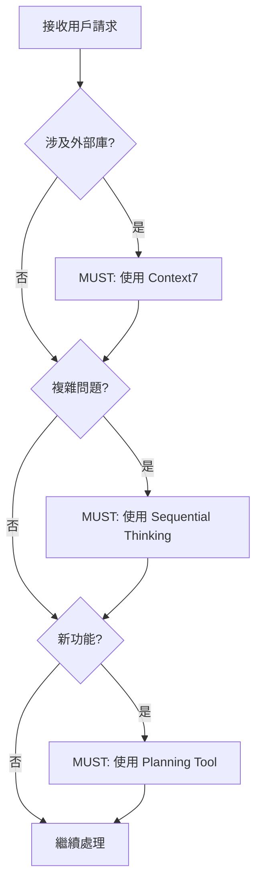
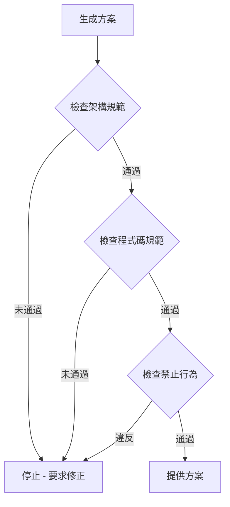

# 遵守政策與執行機制

> **目的**: 定義 Copilot 如何被動 100% 遵守專案規範，以及違規處理機制

## 🎯 核心目標

確保 GitHub Copilot 在**每次回應前**自動檢查並遵守所有強制規則，達成 **100% 被動遵守**。

## 🔴 強制執行層級

### Level 1: MUST (必須) - 強制執行 🔴

**違反後果**: 立即停止，要求修正

#### 工具使用 (MANDATORY)
- [ ] Context7 - 查詢外部庫/框架文檔
- [ ] Sequential Thinking - 複雜問題分析
- [ ] Software Planning Tool - 新功能規劃

#### 架構規範 (MANDATORY)
- [ ] 三層架構分離 (UI → Service → Repository)
- [ ] Repository 模式 (禁止直接操作 Firestore)
- [ ] Firestore Security Rules (所有 collection 必須有)
- [ ] 生命週期管理標準

#### 程式碼規範 (MANDATORY)
- [ ] Standalone Components (禁止 NgModule)
- [ ] Signals 狀態管理
- [ ] inject() 依賴注入 (禁止 constructor 注入)
- [ ] 新控制流語法 (@if, @for, @switch)
- [ ] 禁止 any 類型

### Level 2: MUST NOT (絕對禁止) - 強制禁止 🚫

**違反後果**: 立即停止，要求重做

#### 絕對禁止行為
- ❌ 直接操作 Firestore (必須使用 Repository)
- ❌ 使用 NgModule (必須使用 Standalone)
- ❌ Constructor 注入 (必須使用 inject())
- ❌ 使用 any 類型
- ❌ 在 constructor 執行業務邏輯
- ❌ 手動管理訂閱 (必須使用 takeUntilDestroyed)
- ❌ UI 層直接呼叫 Repository
- ❌ 憑記憶提供 API 用法 (必須使用 Context7)
- ❌ 跳過工具使用驗證
- ❌ 建立 SQL/RLS (使用 Firestore Security Rules)

### Level 3: SHOULD (應該) - 強烈建議 ⚠️

**違反後果**: 警告，建議修正

- OnPush 變更檢測策略
- TrackBy 函數優化列表
- 單元測試覆蓋率 > 80%
- JSDoc 註解

### Level 4: MAY (可選) - 建議 ℹ️

**違反後果**: 無

- Virtual Scrolling
- E2E 測試

## 🔄 自動檢查流程

### Phase 1: 請求接收 (Request Received)



### Phase 2: 方案生成 (Solution Generation)



### Phase 3: 驗證聲明 (Verification Statement)

**每個回應 MUST 包含**:

```markdown
### 🔍 強制規則遵守驗證

#### 工具使用驗證 ✅
- [x] Context7: 已使用 / 不需要
- [x] Sequential Thinking: 已使用 / 不需要
- [x] Planning Tool: 已使用 / 不需要

#### 架構驗證 ✅
- [x] 三層架構分離: 是
- [x] Repository 模式: 是
- [x] Security Rules: 已實作
- [x] 生命週期管理: 符合標準

#### 程式碼驗證 ✅
- [x] Standalone Components: 是
- [x] Signals: 是
- [x] inject(): 是
- [x] 新語法: 是
- [x] 無 any 類型: 是

#### 禁止行為檢查 ✅
- [x] 無直接操作 Firestore
- [x] 無 NgModule
- [x] 無 constructor 注入
- [x] 無業務邏輯在 constructor
- [x] 無手動管理訂閱
```

## 🚨 違規處理機制

### 1. 自動偵測

**Copilot MUST 在提供方案前自動檢查**:

```typescript
interface ComplianceCheck {
  level: 'MUST' | 'MUST_NOT' | 'SHOULD' | 'MAY';
  category: 'tool' | 'architecture' | 'code' | 'security';
  rule: string;
  status: 'pass' | 'fail' | 'warning';
  message?: string;
}

// 示例檢查
const checks: ComplianceCheck[] = [
  {
    level: 'MUST',
    category: 'tool',
    rule: 'Context7 usage for external library',
    status: 'pass'
  },
  {
    level: 'MUST_NOT',
    category: 'code',
    rule: 'No NgModule usage',
    status: 'pass'
  }
];
```

### 2. 違規等級與處理

#### Level 1 違規 (MUST 未遵守)

**後果**: 立即停止執行

**處理流程**:
1. 停止當前回應
2. 顯示違規訊息
3. 說明正確做法
4. 要求用戶確認後重新開始

**示例**:
```
🚫 強制規則違規 (MUST)

違規類別: 工具使用
違規規則: 必須使用 Context7 查詢外部庫 API

說明: 您的請求涉及 Angular Signals API，但未使用 Context7 驗證。

正確做法:
1. 使用 resolve-library-id 查詢 Angular
2. 使用 get-library-docs 獲取 Signals 文檔
3. 基於最新文檔提供方案

是否重新開始? (使用正確流程)
```

#### Level 2 違規 (MUST NOT 違反)

**後果**: 立即停止並要求重做

**處理流程**:
1. 停止當前回應
2. 標記違反的禁止行為
3. 說明為何禁止
4. 提供替代方案
5. 要求完全重做

**示例**:
```
🔴 絕對禁止行為違反 (MUST NOT)

違規行為: 直接操作 Firestore

違反代碼:
```typescript
// ❌ 禁止
const tasksRef = collection(firestore, 'tasks');
const snapshot = await getDocs(tasksRef);
```

為何禁止:
- 違反 Repository 模式
- 無法統一資料存取邏輯
- 難以測試和維護
- 違反專案架構原則

正確做法:
```typescript
// ✅ 正確
@Injectable({ providedIn: 'root' })
export class TaskRepository {
  private firestore = inject(Firestore);
  
  findAll(): Observable<Task[]> {
    const tasksCollection = collection(this.firestore, 'tasks');
    return collectionData(tasksCollection, { idField: 'id' }) as Observable<Task[]>;
  }
}
```

請使用 Repository 模式重做。
```

#### Level 3 違規 (SHOULD 未遵守)

**後果**: 警告，建議修正

**處理流程**:
1. 繼續提供方案
2. 附加警告訊息
3. 說明最佳實踐
4. 提供改進建議

**示例**:
```
⚠️ 最佳實踐建議 (SHOULD)

建議項目: 使用 OnPush 變更檢測策略

當前實作: 使用預設變更檢測
建議實作: ChangeDetectionStrategy.OnPush

原因:
- 減少不必要的變更檢測
- 提升應用效能
- 更可預測的行為

如何改進:
@Component({
  changeDetection: ChangeDetectionStrategy.OnPush
})

您的實作已符合強制規範，但建議考慮此優化。
```

## 📊 合規追蹤

### 每次回應追蹤指標

```typescript
interface ComplianceMetrics {
  taskId: string;
  timestamp: string;
  
  // 工具使用
  context7Used: boolean;
  sequentialThinkingUsed: boolean;
  planningToolUsed: boolean;
  
  // 架構合規
  threeLayerArchitecture: boolean;
  repositoryPattern: boolean;
  securityRules: boolean;
  lifecycleManagement: boolean;
  
  // 程式碼合規
  standaloneComponents: boolean;
  signalsUsage: boolean;
  injectUsage: boolean;
  newSyntax: boolean;
  noAnyType: boolean;
  
  // 禁止行為檢查
  noDirectFirestore: boolean;
  noNgModule: boolean;
  noConstructorInjection: boolean;
  noManualSubscription: boolean;
  
  // 違規記錄
  violations: ComplianceCheck[];
}
```

### 合規報告格式

```markdown
## 合規性報告

**任務**: [任務描述]
**時間**: 2025-12-17 19:00:00

### 強制規則 (MUST) ✅
- Context7 使用: ✅
- Sequential Thinking: ✅
- Planning Tool: ✅
- 三層架構: ✅
- Repository 模式: ✅
- Security Rules: ✅

### 禁止行為 (MUST NOT) ✅
- 無直接 Firestore: ✅
- 無 NgModule: ✅
- 無 constructor 注入: ✅
- 無 any 類型: ✅

### 建議事項 (SHOULD) ⚠️
- OnPush 策略: ⚠️ 未使用
- TrackBy 函數: ✅

### 違規記錄
無違規 ✅

### 改進建議
建議使用 OnPush 變更檢測策略以優化效能
```

## 🔍 例外處理政策

### 何時允許例外

**ONLY in these cases:**

1. **技術限制** - 外部庫本身的限制
   - 必須: 詳細文檔說明原因
   - 必須: 提供緩解措施
   - 必須: 標記為技術債務

2. **過渡期** - 遷移現有程式碼
   - 必須: 制定遷移計畫
   - 必須: 設定完成時間
   - 必須: 記錄進度

3. **實驗性功能** - 探索新方案
   - 必須: 明確標記為實驗
   - 必須: 不能用於生產環境
   - 必須: 有正式方案後替換

### 例外申請流程

```markdown
## 例外申請

**規則**: [違反的規則]
**原因**: [為何需要例外]
**類型**: [技術限制 / 過渡期 / 實驗性]
**影響**: [影響範圍和風險]
**緩解**: [緩解措施]
**期限**: [預期解決時間]
**審批**: [需要團隊審批]
```

## 📚 參考資源

### 相關規則文檔

- [強制工作流程](./mandatory-workflow.md)
- [專案開發規則](./project-rules.md)
- [架構設計原則](./architectural-principles.md)
- [約束規則](../copilot/constraints.md)

### 外部標準

- [Angular 官方文檔](https://angular.dev)
- [Firebase 最佳實踐](https://firebase.google.com/docs/firestore/best-practices)
- [GitHub Copilot 自定義指令](https://docs.github.com/copilot/customizing-copilot)

## 🔄 持續改進

### 規則更新機制

1. **識別改進需求**
   - 來自開發實踐的反饋
   - 技術演進的需要
   - 團隊共識的決策

2. **使用 Context7 驗證**
   - 查詢最新最佳實踐
   - 驗證技術可行性
   - 確認與現有規則一致

3. **使用 Sequential Thinking 分析**
   - 評估影響範圍
   - 識別潛在風險
   - 制定遷移策略

4. **更新文檔**
   - 更新相關規則檔案
   - 更新主配置檔案
   - 通知團隊成員

5. **驗證執行**
   - 測試 Copilot 正確讀取
   - 驗證自動檢查機制
   - 收集反饋並調整

---

**版本**: v1.0  
**最後更新**: 2025-12-17  
**強制執行**: MANDATORY - 100% Compliance Required
