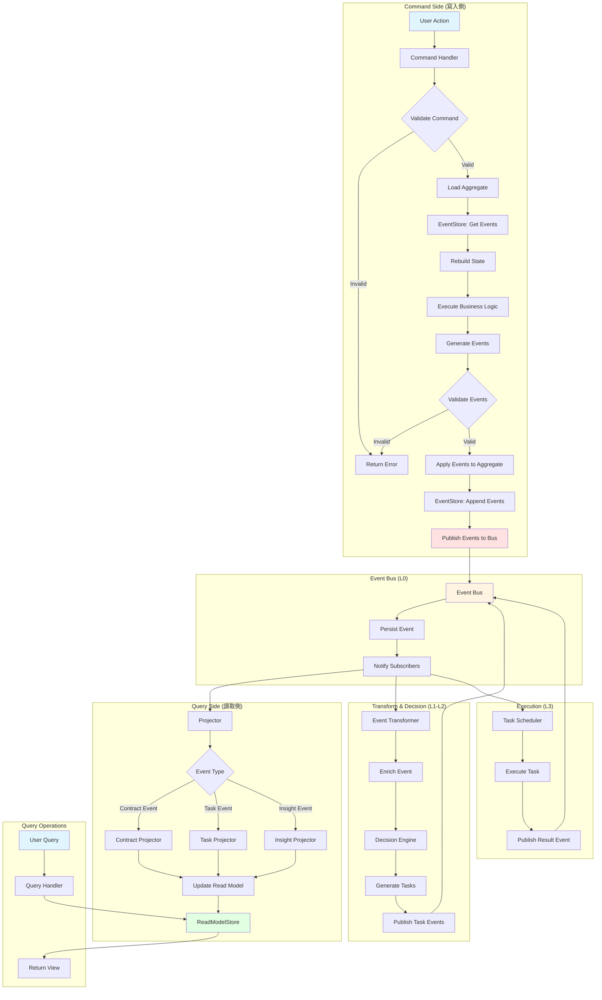

# Event Sourcing Architecture Guide

## 概述

ng-lin 系統採用 Event Sourcing + CQRS 架構模式，以事件作為唯一的真實來源（Single Source of Truth）。本文檔說明核心架構設計、實作規範和最佳實踐。

## 核心概念

### Event Sourcing

Event Sourcing 是一種將所有狀態變更儲存為事件序列的架構模式，而非直接更新當前狀態。

**核心原則：**
- 事件是不可變的（Immutable）
- 事件按時間順序儲存（Append-only）
- 當前狀態從事件流重建（Rebuild from Events）
- 完整的審計追蹤（Full Audit Trail）

### CQRS (Command Query Responsibility Segregation)

分離讀取和寫入的資料模型，優化各自的效能和複雜度。

**核心原則：**
- Command：寫入操作，產生事件
- Query：讀取操作，查詢優化過的視圖
- 最終一致性（Eventually Consistent）

## 架構層級

```
┌─────────────────────────────────────────────────────────────┐
│  L-2: Identity Layer (身份層)                                │
│  • 數位簽名                                                   │
│  • 身份驗證                                                   │
│  • 權限管理                                                   │
└─────────────────────────────────────────────────────────────┘
                           ↓
┌─────────────────────────────────────────────────────────────┐
│  L-1: Contract Layer (合約層)                                │
│  • 合約定義                                                   │
│  • 合約模板                                                   │
│  • 版本控制                                                   │
└─────────────────────────────────────────────────────────────┘
                           ↓
┌─────────────────────────────────────────────────────────────┐
│  L0: Event Bus (事件匯流排)                                   │
│  • 事件發布/訂閱                                              │
│  • 事件持久化                                                 │
│  • 事件重放                                                   │
└─────────────────────────────────────────────────────────────┘
                           ↓
┌─────────────────────────────────────────────────────────────┐
│  L1: Event Transform (事件轉換層)                             │
│  • 事件聚合                                                   │
│  • 事件轉換                                                   │
│  • 事件豐富化                                                 │
└─────────────────────────────────────────────────────────────┘
                           ↓
┌─────────────────────────────────────────────────────────────┐
│  L2: Decision Engine (決策引擎)                               │
│  • 規則執行                                                   │
│  • 任務生成                                                   │
│  • 優先級計算                                                 │
└─────────────────────────────────────────────────────────────┘
                           ↓
┌─────────────────────────────────────────────────────────────┐
│  L3: Execution Layer (執行層)                                 │
│  • 任務調度                                                   │
│  • 狀態管理                                                   │
│  • 結果反饋                                                   │
└─────────────────────────────────────────────────────────────┘
```

## 完整流程圖



## 核心組件規範

### 1. Event (事件)

所有事件必須遵循統一的結構：

```typescript
/**
 * 基礎事件介面
 * 所有系統事件的基礎結構
 */
interface BaseEvent {
  /** 事件唯一識別碼 (UUID v4) */
  id: string;
  
  /** 事件類型 (格式: aggregate.action) */
  type: string;
  
  /** 事件發生時間戳 (Unix timestamp) */
  timestamp: number;
  
  /** 聚合根 ID */
  aggregateId: string;
  
  /** 聚合根類型 */
  aggregateType: 'contract' | 'task' | 'rule' | 'user';
  
  /** 聚合根版本號 (樂觀鎖) */
  version: number;
  
  /** 事件負載 (業務數據) */
  payload: unknown;
  
  /** 事件元數據 */
  metadata: {
    /** 操作用戶 ID */
    userId?: string;
    
    /** 數位簽名 (L-2 層) */
    signature?: string;
    
    /** 關聯 ID (用於追蹤因果關係) */
    correlationId?: string;
    
    /** 因果 ID (父事件 ID) */
    causationId?: string;
    
    /** IP 位址 */
    ipAddress?: string;
    
    /** User Agent */
    userAgent?: string;
  };
}
```

**命名規範：**
- 事件類型使用過去式：`contract.created`, `task.completed`
- 格式：`{aggregate}.{action}`
- 範例：`contract.signed`, `task.assigned`, `rule.updated`

### 2. Aggregate (聚合根)

聚合根是業務邏輯的封裝單位，負責：
- 驗證業務規則
- 產生事件
- 維護內部狀態

```typescript
/**
 * 抽象聚合根基類
 */
abstract class AggregateRoot {
  protected id: string;
  protected version: number = 0;
  private uncommittedEvents: BaseEvent[] = [];

  constructor(id: string) {
    this.id = id;
  }

  /**
   * 獲取聚合根 ID
   */
  getId(): string {
    return this.id;
  }

  /**
   * 獲取當前版本號
   */
  getVersion(): number {
    return this.version;
  }

  /**
   * 獲取未提交的事件
   */
  getUncommittedEvents(): BaseEvent[] {
    return [...this.uncommittedEvents];
  }

  /**
   * 清空未提交的事件
   */
  clearUncommittedEvents(): void {
    this.uncommittedEvents = [];
  }

  /**
   * 從事件流重建聚合根
   */
  loadFromHistory(events: BaseEvent[]): void {
    events.forEach(event => {
      this.applyEvent(event, false);
    });
  }

  /**
   * 應用新事件
   * @param event 事件
   * @param isNew 是否為新產生的事件
   */
  protected applyEvent(event: BaseEvent, isNew: boolean = true): void {
    // 調用具體的事件處理方法
    this.when(event);
    
    this.version++;
    
    if (isNew) {
      this.uncommittedEvents.push(event);
    }
  }

  /**
   * 事件處理方法 (由子類實作)
   */
  protected abstract when(event: BaseEvent): void;

  /**
   * 產生新事件的輔助方法
   */
  protected raiseEvent(event: Omit<BaseEvent, 'id' | 'timestamp' | 'version'>): void {
    const fullEvent: BaseEvent = {
      ...event,
      id: this.generateEventId(),
      timestamp: Date.now(),
      version: this.version + 1,
    };
    
    this.applyEvent(fullEvent, true);
  }

  private generateEventId(): string {
    // 使用 UUID v4
    return crypto.randomUUID();
  }
}
```

**範例：合約聚合根**

```typescript
/**
 * 合約聚合根
 */
class ContractAggregate extends AggregateRoot {
  private state: {
    name: string;
    description: string;
    template: string;
    status: 'draft' | 'pending_signature' | 'signed' | 'active' | 'expired';
    createdAt: number;
    signatures: Array<{
      signerId: string;
      signature: string;
      signedAt: number;
    }>;
    requiredSignatures: number;
  } | null = null;

  /**
   * 創建新合約
   */
  create(data: {
    name: string;
    description: string;
    template: string;
    requiredSignatures: number;
    userId: string;
  }): void {
    // 業務規則驗證
    if (this.state !== null) {
      throw new Error('Contract already exists');
    }

    if (!data.name || data.name.trim().length === 0) {
      throw new Error('Contract name is required');
    }

    if (data.requiredSignatures < 1) {
      throw new Error('At least one signature is required');
    }

    // 產生事件
    this.raiseEvent({
      type: 'contract.created',
      aggregateId: this.id,
      aggregateType: 'contract',
      payload: {
        name: data.name,
        description: data.description,
        template: data.template,
        requiredSignatures: data.requiredSignatures,
      },
      metadata: {
        userId: data.userId,
      },
    });
  }

  /**
   * 簽署合約
   */
  sign(data: {
    signerId: string;
    signature: string;
  }): void {
    // 業務規則驗證
    if (this.state === null) {
      throw new Error('Contract does not exist');
    }

    if (this.state.status !== 'draft' && this.state.status !== 'pending_signature') {
      throw new Error(`Cannot sign contract in ${this.state.status} status`);
    }

    // 檢查是否已簽署
    const alreadySigned = this.state.signatures.some(
      sig => sig.signerId === data.signerId
    );
    if (alreadySigned) {
      throw new Error('Signer has already signed this contract');
    }

    // 產生事件
    this.raiseEvent({
      type: 'contract.signed',
      aggregateId: this.id,
      aggregateType: 'contract',
      payload: {
        signerId: data.signerId,
        signature: data.signature,
      },
      metadata: {
        userId: data.signerId,
      },
    });

    // 如果達到所需簽名數，自動啟動合約
    if (this.state.signatures.length + 1 >= this.state.requiredSignatures) {
      this.raiseEvent({
        type: 'contract.activated',
        aggregateId: this.id,
        aggregateType: 'contract',
        payload: {},
        metadata: {
          userId: data.signerId,
        },
      });
    }
  }

  /**
   * 事件處理 (更新內部狀態)
   */
  protected when(event: BaseEvent): void {
    switch (event.type) {
      case 'contract.created':
        this.whenContractCreated(event);
        break;
      case 'contract.signed':
        this.whenContractSigned(event);
        break;
      case 'contract.activated':
        this.whenContractActivated(event);
        break;
    }
  }

  private whenContractCreated(event: BaseEvent): void {
    const payload = event.payload as any;
    this.state = {
      name: payload.name,
      description: payload.description,
      template: payload.template,
      status: 'draft',
      createdAt: event.timestamp,
      signatures: [],
      requiredSignatures: payload.requiredSignatures,
    };
  }

  private whenContractSigned(event: BaseEvent): void {
    const payload = event.payload as any;
    this.state!.signatures.push({
      signerId: payload.signerId,
      signature: payload.signature,
      signedAt: event.timestamp,
    });
    this.state!.status = 'pending_signature';
  }

  private whenContractActivated(event: BaseEvent): void {
    this.state!.status = 'active';
  }

  /**
   * 獲取當前狀態 (僅供查詢)
   */
  getState() {
    return this.state ? { ...this.state } : null;
  }
}
```

### 3. EventStore (事件存儲)

事件存儲負責持久化和檢索事件。

```typescript
/**
 * 事件存儲介面
 */
interface IEventStore {
  /**
   * 追加事件到聚合根
   * @param aggregateId 聚合根 ID
   * @param expectedVersion 預期版本 (樂觀鎖)
   * @param events 要追加的事件列表
   */
  appendEvents(
    aggregateId: string,
    expectedVersion: number,
    events: BaseEvent[]
  ): Promise<void>;

  /**
   * 獲取聚合根的所有事件
   * @param aggregateId 聚合根 ID
   * @param fromVersion 起始版本 (可選)
   */
  getEvents(
    aggregateId: string,
    fromVersion?: number
  ): Promise<BaseEvent[]>;

  /**
   * 獲取所有事件 (用於重建讀取模型)
   * @param fromTimestamp 起始時間戳 (可選)
   */
  getAllEvents(fromTimestamp?: number): Promise<BaseEvent[]>;

  /**
   * 獲取特定類型的事件
   * @param eventType 事件類型
   * @param fromTimestamp 起始時間戳 (可選)
   */
  getEventsByType(
    eventType: string,
    fromTimestamp?: number
  ): Promise<BaseEvent[]>;
}
```

**Supabase 實作範例：**

```sql
-- 事件存儲表
CREATE TABLE events (
  id UUID PRIMARY KEY,
  type VARCHAR(100) NOT NULL,
  timestamp BIGINT NOT NULL,
  aggregate_id UUID NOT NULL,
  aggregate_type VARCHAR(50) NOT NULL,
  version INTEGER NOT NULL,
  payload JSONB NOT NULL,
  metadata JSONB NOT NULL,
  created_at TIMESTAMP DEFAULT NOW(),
  
  -- 確保版本唯一性 (樂觀鎖)
  UNIQUE(aggregate_id, version)
);

-- 索引優化
CREATE INDEX idx_events_aggregate ON events(aggregate_id, version);
CREATE INDEX idx_events_type ON events(type);
CREATE INDEX idx_events_timestamp ON events(timestamp);
```

```typescript
/**
 * Supabase 事件存儲實作
 */
class SupabaseEventStore implements IEventStore {
  constructor(private supabase: SupabaseClient) {}

  async appendEvents(
    aggregateId: string,
    expectedVersion: number,
    events: BaseEvent[]
  ): Promise<void> {
    // 驗證版本
    const { data: existing } = await this.supabase
      .from('events')
      .select('version')
      .eq('aggregate_id', aggregateId)
      .order('version', { ascending: false })
      .limit(1)
      .single();

    const currentVersion = existing?.version ?? 0;
    
    if (currentVersion !== expectedVersion) {
      throw new Error(
        `Concurrency conflict: expected version ${expectedVersion}, but current is ${currentVersion}`
      );
    }

    // 插入事件
    const rows = events.map(event => ({
      id: event.id,
      type: event.type,
      timestamp: event.timestamp,
      aggregate_id: event.aggregateId,
      aggregate_type: event.aggregateType,
      version: event.version,
      payload: event.payload,
      metadata: event.metadata,
    }));

    const { error } = await this.supabase
      .from('events')
      .insert(rows);

    if (error) {
      throw new Error(`Failed to append events: ${error.message}`);
    }
  }

  async getEvents(
    aggregateId: string,
    fromVersion: number = 0
  ): Promise<BaseEvent[]> {
    const { data, error } = await this.supabase
      .from('events')
      .select('*')
      .eq('aggregate_id', aggregateId)
      .gte('version', fromVersion)
      .order('version', { ascending: true });

    if (error) {
      throw new Error(`Failed to get events: ${error.message}`);
    }

    return data.map(row => this.mapRowToEvent(row));
  }

  async getAllEvents(fromTimestamp: number = 0): Promise<BaseEvent[]> {
    const { data, error } = await this.supabase
      .from('events')
      .select('*')
      .gte('timestamp', fromTimestamp)
      .order('timestamp', { ascending: true });

    if (error) {
      throw new Error(`Failed to get all events: ${error.message}`);
    }

    return data.map(row => this.mapRowToEvent(row));
  }

  async getEventsByType(
    eventType: string,
    fromTimestamp: number = 0
  ): Promise<BaseEvent[]> {
    const { data, error } = await this.supabase
      .from('events')
      .select('*')
      .eq('type', eventType)
      .gte('timestamp', fromTimestamp)
      .order('timestamp', { ascending: true });

    if (error) {
      throw new Error(`Failed to get events by type: ${error.message}`);
    }

    return data.map(row => this.mapRowToEvent(row));
  }

  private mapRowToEvent(row: any): BaseEvent {
    return {
      id: row.id,
      type: row.type,
      timestamp: row.timestamp,
      aggregateId: row.aggregate_id,
      aggregateType: row.aggregate_type,
      version: row.version,
      payload: row.payload,
      metadata: row.metadata,
    };
  }
}
```

### 4. Command Handler (命令處理器)

命令處理器負責協調業務邏輯執行。

```typescript
/**
 * 命令介面
 */
interface Command {
  type: string;
  aggregateId: string;
  payload: unknown;
  metadata?: {
    userId?: string;
    correlationId?: string;
  };
}

/**
 * 命令處理器介面
 */
interface ICommandHandler<T extends Command> {
  handle(command: T): Promise<void>;
}

/**
 * 範例：創建合約命令處理器
 */
class CreateContractCommandHandler implements ICommandHandler<CreateContractCommand> {
  constructor(
    private eventStore: IEventStore,
    private eventBus: IEventBus
  ) {}

  async handle(command: CreateContractCommand): Promise<void> {
    // 1. 創建聚合根
    const aggregate = new ContractAggregate(command.aggregateId);

    // 2. 執行業務邏輯
    aggregate.create({
      name: command.payload.name,
      description: command.payload.description,
      template: command.payload.template,
      requiredSignatures: command.payload.requiredSignatures,
      userId: command.metadata?.userId || 'system',
    });

    // 3. 持久化事件
    const events = aggregate.getUncommittedEvents();
    await this.eventStore.appendEvents(
      command.aggregateId,
      aggregate.getVersion() - events.length,
      events
    );

    // 4. 發布事件到事件總線
    for (const event of events) {
      await this.eventBus.publish(event);
    }

    // 5. 清空未提交事件
    aggregate.clearUncommittedEvents();
  }
}
```

### 5. Event Bus (事件總線)

事件總線負責事件的發布和訂閱。

```typescript
/**
 * 事件總線介面
 */
interface IEventBus {
  /**
   * 發布事件
   */
  publish(event: BaseEvent): Promise<void>;

  /**
   * 訂閱事件
   */
  subscribe(
    eventType: string,
    handler: (event: BaseEvent) => Promise<void>
  ): void;

  /**
   * 訂閱所有事件
   */
  subscribeAll(
    handler: (event: BaseEvent) => Promise<void>
  ): void;
}

/**
 * RxJS 事件總線實作
 */
class RxJsEventBus implements IEventBus {
  private subject = new Subject<BaseEvent>();
  private subscriptions = new Map<string, Array<(event: BaseEvent) => Promise<void>>>();

  async publish(event: BaseEvent): Promise<void> {
    // 發布到 RxJS Subject
    this.subject.next(event);

    // 執行特定類型的訂閱者
    const handlers = this.subscriptions.get(event.type) || [];
    await Promise.all(handlers.map(handler => handler(event)));

    // 執行全局訂閱者
    const allHandlers = this.subscriptions.get('*') || [];
    await Promise.all(allHandlers.map(handler => handler(event)));
  }

  subscribe(
    eventType: string,
    handler: (event: BaseEvent) => Promise<void>
  ): void {
    if (!this.subscriptions.has(eventType)) {
      this.subscriptions.set(eventType, []);
    }
    this.subscriptions.get(eventType)!.push(handler);
  }

  subscribeAll(handler: (event: BaseEvent) => Promise<void>): void {
    this.subscribe('*', handler);
  }

  getObservable(): Observable<BaseEvent> {
    return this.subject.asObservable();
  }
}
```

### 6. Projector (投影器)

投影器負責將事件轉換為讀取模型。

```typescript
/**
 * 投影器介面
 */
interface IProjector {
  /**
   * 處理事件
   */
  project(event: BaseEvent): Promise<void>;

  /**
   * 重建投影 (從事件流)
   */
  rebuild(events: BaseEvent[]): Promise<void>;
}

/**
 * 合約投影器
 */
class ContractProjector implements IProjector {
  constructor(private supabase: SupabaseClient) {}

  async project(event: BaseEvent): Promise<void> {
    switch (event.type) {
      case 'contract.created':
        await this.handleContractCreated(event);
        break;
      case 'contract.signed':
        await this.handleContractSigned(event);
        break;
      case 'contract.activated':
        await this.handleContractActivated(event);
        break;
    }
  }

  async rebuild(events: BaseEvent[]): Promise<void> {
    // 清空現有投影
    await this.supabase.from('contract_views').delete().neq('id', '');

    // 重建投影
    for (const event of events) {
      await this.project(event);
    }
  }

  private async handleContractCreated(event: BaseEvent): Promise<void> {
    const payload = event.payload as any;
    
    await this.supabase.from('contract_views').insert({
      id: event.aggregateId,
      name: payload.name,
      description: payload.description,
      template: payload.template,
      status: 'draft',
      required_signatures: payload.requiredSignatures,
      signature_count: 0,
      created_at: new Date(event.timestamp).toISOString(),
      updated_at: new Date(event.timestamp).toISOString(),
    });
  }

  private async handleContractSigned(event: BaseEvent): Promise<void> {
    const { data: current } = await this.supabase
      .from('contract_views')
      .select('signature_count')
      .eq('id', event.aggregateId)
      .single();

    await this.supabase
      .from('contract_views')
      .update({
        signature_count: (current?.signature_count || 0) + 1,
        status: 'pending_signature',
        updated_at: new Date(event.timestamp).toISOString(),
      })
      .eq('id', event.aggregateId);
  }

  private async handleContractActivated(event: BaseEvent): Promise<void> {
    await this.supabase
      .from('contract_views')
      .update({
        status: 'active',
        updated_at: new Date(event.timestamp).toISOString(),
      })
      .eq('id', event.aggregateId);
  }
}
```

## 最佳實踐

### 1. 事件設計原則

✅ **DO:**
- 使用過去式命名事件
- 事件應該是業務語言，而非技術語言
- 事件應該完整描述發生了什麼
- 事件應該包含所有必要的上下文信息
- 保持事件不可變

❌ **DON'T:**
- 不要在事件中包含聚合根的完整狀態
- 不要使用現在式或未來式命名
- 不要在事件中執行業務邏輯
- 不要修改已發布的事件

### 2. 聚合根設計原則

✅ **DO:**
- 保持聚合根小而內聚
- 在聚合根內驗證所有業務規則
- 使用事件重建狀態，而非直接設置
- 保護聚合根的不變性

❌ **DON'T:**
- 不要在聚合根中查詢外部數據
- 不要在聚合根中調用其他聚合根
- 不要在事件處理方法中執行業務邏輯
- 不要暴露可變的內部狀態

### 3. 並發處理

使用樂觀鎖防止並發衝突：

```typescript
try {
  await eventStore.appendEvents(aggregateId, expectedVersion, events);
} catch (error) {
  if (error.message.includes('Concurrency conflict')) {
    // 重新載入聚合根
    const aggregate = await repository.getById(aggregateId);
    
    // 重試命令
    aggregate.executeCommand(command);
    
    // 再次嘗試保存
    await repository.save(aggregate);
  }
}
```

### 4. 事件版本演進

當事件結構需要變更時：

```typescript
// V1 事件
interface ContractCreatedV1 {
  type: 'contract.created.v1';
  payload: {
    name: string;
    template: string;
  };
}

// V2 事件 (新增 description 欄位)
interface ContractCreatedV2 {
  type: 'contract.created.v2';
  payload: {
    name: string;
    description: string;
    template: string;
  };
}

// 事件升級器
class EventUpgrader {
  upgrade(event: BaseEvent): BaseEvent {
    if (event.type === 'contract.created.v1') {
      return {
        ...event,
        type: 'contract.created.v2',
        payload: {
          ...(event.payload as any),
          description: '', // 默認值
        },
      };
    }
    return event;
  }
}
```

### 5. 快照優化

對於事件過多的聚合根，使用快照提升性能：

```typescript
interface Snapshot {
  aggregateId: string;
  version: number;
  state: unknown;
  timestamp: number;
}

class SnapshotStore {
  async saveSnapshot(snapshot: Snapshot): Promise<void> {
    // 保存快照
  }