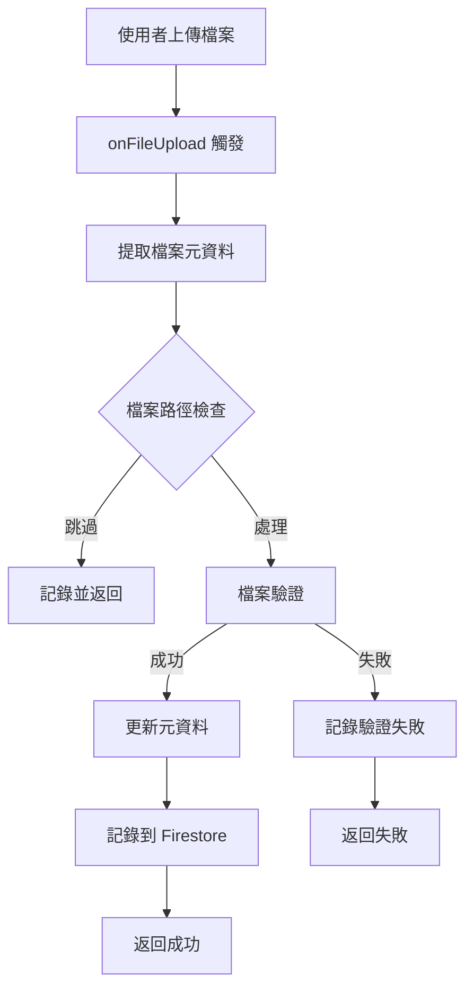
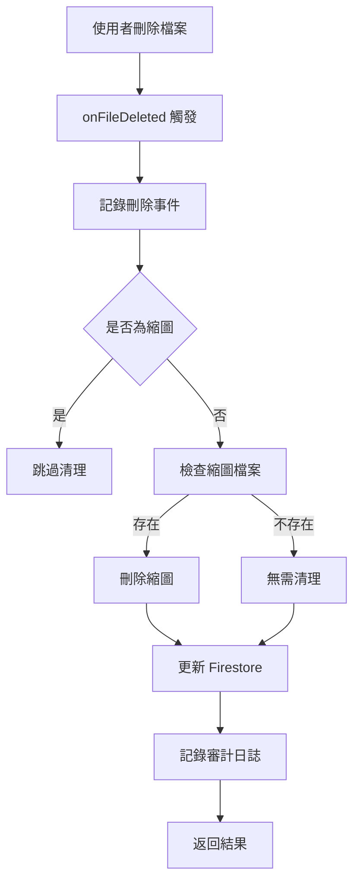

# Functions Storage Module (企業標準版)

## 📋 概述

`functions-storage` 模組負責處理 Firebase Cloud Storage 相關的檔案管理功能。基於 **Firebase Functions v2 API** 和最新的 **Firebase Admin Node.js SDK**，實現企業級的檔案管理解決方案。

**文檔來源**: 所有實作基於 Context7 查詢的官方文檔
- Firebase Functions v2 Storage Triggers (`onObjectFinalized`, `onObjectDeleted`)
- Firebase Admin Node.js Storage API
- Firebase Security Best Practices

**核心特性**:
- ✅ 現代化 Firebase Functions v2 API
- ✅ 完整的錯誤處理與重試機制
- ✅ 結構化日誌與效能監控
- ✅ 企業級安全驗證
- ✅ 自動化備份策略
- ✅ 審計追蹤與合規性

## 🎯 核心功能

### 1. 檔案上傳處理 (File Upload Processing)

**觸發器**: `onObjectFinalized` (Firebase Functions v2)

監聽所有儲存桶的檔案上傳事件，自動驗證和處理上傳的檔案。

**企業標準功能特性**：
- ✅ 多層次檔案驗證（類型、大小、副檔名）
- ✅ 自動元資料標記與分類
- ✅ 安全檢查與威脅偵測
- ✅ 結構化事件日誌到 Firestore
- ✅ 完整錯誤處理與重試機制
- ✅ 效能追蹤與監控

**驗證規則**：
```typescript
// 基於 Context7 查詢的最佳實踐
- 最大大小: 100MB (企業標準)
- 封鎖副檔名: .exe, .bat, .cmd, .sh, .ps1, .msi, .dll, .scr, .vbs, .js, .jar
- 允許類型: 
  * 圖片 (image/jpeg, image/png, image/gif, image/webp, image/svg+xml)
  * 影片 (video/mp4, video/mpeg, video/quicktime, video/webm)
  * 音訊 (audio/mpeg, audio/wav, audio/ogg)
  * 文件 (PDF, MS Office, Text, CSV)
  * 壓縮檔 (ZIP, RAR, 7Z)
```

**元資料結構** (TypeScript):
```typescript
interface FileMetadata {
  processed: 'true' | 'false';
  validationStatus: 'success' | 'failed';
  processedAt: string;
  originalName: string;
  fileType: 'image' | 'document' | 'video' | 'audio' | 'archive' | 'text' | 'other';
  requiresThumbnail: 'true' | 'false';
  requiresProcessing: 'true' | 'false';
  scanStatus: 'pending' | 'clean' | 'infected' | 'error';
  validationReason?: string;
}
```

**實作範例**:
```typescript
// Based on Context7 Firebase Functions v2 documentation
import { onObjectFinalized } from 'firebase-functions/v2/storage';

export const onFileUpload = onObjectFinalized({
  region: 'asia-east1',
  memory: '1GiB',
  timeoutSeconds: 300,
  maxInstances: 10,
}, async (event) => {
  const filePath = event.data.name;
  const contentType = event.data.contentType;
  const fileSize = parseInt(event.data.size || '0');
  
  // 企業級驗證與處理邏輯
  // ... (詳見 src/handlers/upload-handler.ts)
});
```

### 2. 檔案刪除處理 (File Deletion Handling)

**觸發器**: `onObjectDeleted` (Firebase Functions v2)

監聽所有儲存桶的檔案刪除事件，自動清理相關資源。

**功能特性**：
- ✅ 自動清理相關縮圖檔案
- ✅ 審計日誌記錄到 Firestore
- ✅ Firestore 檔案記錄同步更新
- ✅ 優雅的錯誤處理（非關鍵操作失敗不影響主流程）
- ✅ 完整的清理追蹤

**實作範例**:
```typescript
// Based on Context7 Firebase Functions v2 documentation
import { onObjectDeleted } from 'firebase-functions/v2/storage';

export const onFileDeleted = onObjectDeleted({
  region: 'asia-east1',
  memory: '512MiB',
  timeoutSeconds: 120,
  maxInstances: 10,
}, async (event) => {
  const filePath = event.data.name;
  
  // 自動清理縮圖與審計記錄
  // ... (詳見 src/handlers/delete-handler.ts)
});
```

### 3. 檔案元資料管理 (File Metadata Management)

**類型**: Callable Function (`onCall`)

提供 HTTP 可呼叫函式，用於更新檔案元資料。

**功能特性**：
- ✅ 需要使用者認證
- ✅ 檔案存在性驗證
- ✅ Storage 與 Firestore 元資料同步
- ✅ 審計追蹤
- ✅ 權限檢查

**請求格式**:
```typescript
interface UpdateMetadataRequest {
  filePath: string;
  metadata: {
    description?: string;
    tags?: string[];
    category?: string;
    [key: string]: any;
  };
}
```

**使用範例**:
```typescript
// Client-side call
const updateMetadata = httpsCallable(functions, 'updateFileMetadata');
const result = await updateMetadata({
  filePath: 'projects/project-1/document.pdf',
  metadata: {
    description: 'Project specification document',
    tags: ['project', 'specification'],
    category: 'documentation'
  }
});
```

### 4. 自動化檔案備份 (Automated File Backup)

**類型**: Scheduled Function (`onSchedule`)

定期自動備份檔案到備份儲存桶。

**排程配置**：
- 執行時間: 每天凌晨 4:00 (Asia/Taipei)
- 時區: Asia/Taipei
- 記憶體: 2GiB
- 逾時: 540 秒 (9 分鐘)
- 最大實例: 1 (確保只有一個備份任務執行)

**功能特性**：
- ✅ 自動化每日備份
- ✅ 進度追蹤與日誌
- ✅ 錯誤恢復能力（個別檔案失敗不影響整體）
- ✅ 備份結果記錄到 Firestore
- ✅ 效能指標監控

**實作範例**:
```typescript
// Based on Context7 Firebase Functions v2 documentation
import { onSchedule } from 'firebase-functions/v2/scheduler';

export const backupFiles = onSchedule({
  schedule: '0 4 * * *',
  timeZone: 'Asia/Taipei',
  region: 'asia-east1',
  memory: '2GiB',
  timeoutSeconds: 540,
  maxInstances: 1,
}, async (event) => {
  // 自動備份邏輯
  // ... (詳見 src/handlers/backup-handler.ts)
});
```

## 💻 技術堆疊

**基於 Context7 查詢的最新版本**:

| 套件 | 版本 | 用途 |
|------|------|------|
| firebase-functions | ^7.0.0 | Firebase Functions v2 API |
| firebase-admin | ^13.6.0 | Firebase Admin SDK |
| TypeScript | ^5.7.3 | 類型安全開發 |
| Node.js | 22 | 執行環境 |

**核心 APIs**:
- `firebase-functions/v2/storage`: `onObjectFinalized`, `onObjectDeleted`
- `firebase-functions/v2/https`: `onCall`
- `firebase-functions/v2/scheduler`: `onSchedule`
- `firebase-admin/storage`: Storage bucket 操作
- `firebase-admin/firestore`: 事件日誌與審計

## 📁 專案結構

```
functions-storage/
├── src/
│   ├── index.ts                 # 主要匯出檔案
│   ├── types/
│   │   └── index.ts            # TypeScript 類型定義
│   ├── utils/
│   │   ├── file-utils.ts       # 檔案驗證與處理工具
│   │   └── logger.ts           # 結構化日誌工具
│   └── handlers/
│       ├── upload-handler.ts   # 檔案上傳處理
│       ├── delete-handler.ts   # 檔案刪除處理
│       ├── metadata-handler.ts # 元資料管理
│       └── backup-handler.ts   # 自動備份
├── package.json
├── tsconfig.json
└── README.md
```

## ⚙️ 配置

### 全域設定

```typescript
// src/index.ts
import { setGlobalOptions } from 'firebase-functions/v2/options';

setGlobalOptions({
  region: 'asia-east1',
  maxInstances: 10,
});
```

### 環境變數

建立 `.env` 檔案：

```bash
# 來源儲存桶 (預設: default)
SOURCE_BUCKET=your-project.appspot.com

# 備份儲存桶
BACKUP_BUCKET=your-project-backups

# 備份前綴 (只備份此前綴的檔案)
BACKUP_PREFIX=projects/
```

## 🚀 開發與部署

### 安裝依賴

```bash
cd functions-storage
npm install
```

### 本地開發

```bash
# 建置
npm run build

# 監視模式
npm run build:watch

# 使用 Firebase Emulator 測試
firebase emulators:start --only functions,storage
```

### 部署到 Firebase

```bash
# 部署所有 storage functions
firebase deploy --only functions:onFileUpload,functions:onFileDeleted,functions:updateFileMetadata,functions:backupFiles

# 或部署個別 function
firebase deploy --only functions:onFileUpload
```

### 監控與日誌

```bash
# 查看 function 日誌
firebase functions:log

# 查看特定 function 日誌
firebase functions:log --only onFileUpload
```

## 📊 事件流程

### 檔案上傳事件流程



### 檔案刪除事件流程



## 🔍 檔案驗證

### validateFile() 函式

根據安全性和大小限制檢查上傳的檔案。

**參數**：
- `contentType`: 檔案的 MIME 類型
- `fileSize`: 檔案大小（位元組）
- `fileName`: 檔案名稱（含副檔名）

**回傳值**：
```typescript
interface FileValidationResult {
  valid: boolean;
  reason?: string;  // 僅在無效時存在
}
```

**範例**：
```typescript
// 有效檔案
{ valid: true }

// 無效檔案
{ valid: false, reason: 'File size 150.25MB exceeds 100MB limit' }
{ valid: false, reason: 'File extension .exe is not allowed for security reasons' }
{ valid: false, reason: 'Content type application/x-executable is not allowed' }
```

## 🔧 輔助函式

### 檔案工具 (file-utils.ts)

| 函式 | 用途 |
|------|------|
| `validateFile()` | 驗證檔案類型、大小與副檔名 |
| `getFileCategory()` | 判斷檔案類別 |
| `isImageFile()` | 檢查是否為圖片 |
| `isDocumentFile()` | 檢查是否為文件 |
| `requiresThumbnail()` | 判斷是否需要縮圖 |
| `sanitizeFileName()` | 清理檔名防止路徑穿越 |
| `getThumbnailPath()` | 產生縮圖路徑 |
| `formatFileSize()` | 格式化檔案大小顯示 |

### 日誌工具 (logger.ts)

| 函式 | 用途 |
|------|------|
| `logFileOperationStart()` | 記錄操作開始 |
| `logFileOperationSuccess()` | 記錄操作成功 |
| `logFileOperationFailure()` | 記錄操作失敗 |
| `logValidationFailure()` | 記錄驗證失敗 |
| `logSecurityEvent()` | 記錄安全事件 |
| `logPerformanceMetric()` | 記錄效能指標 |
| `logCleanup()` | 記錄清理操作 |

## 📝 事件記錄

所有儲存事件記錄到 Firestore 集合：

### storage_events 集合

```typescript
interface StorageEventLog {
  eventType: 'upload' | 'delete' | 'metadata_update';
  filePath: string;
  contentType?: string;
  fileSize?: number;
  bucket: string;
  timestamp: Timestamp;
  status: 'success' | 'failed';
  errorMessage?: string;
  userId?: string;
  metadata?: Record<string, any>;
}
```

### file_deletion_logs 集合

```typescript
{
  filePath: string;
  fileName: string;
  deletedAt: Timestamp;
  fileSize: number;
  contentType: string;
  thumbnailCleaned: boolean;
  thumbnailCleanupError?: string;
}
```

### backup_logs 集合

```typescript
{
  type: 'files';
  timestamp: Timestamp;
  filesCount: number;
  backedUpCount: number;
  errorCount: number;
  backupPath: string;
  duration: number;
  success: boolean;
  errors?: Array<{fileName: string; error: string}>;
}
```

## 🛡️ 錯誤處理

所有函式包含企業級錯誤處理：

### 錯誤處理策略

1. **Try-Catch 區塊**: 所有主要操作都包裝在 try-catch 中
2. **詳細日誌**: 錯誤包含完整上下文資訊
3. **優雅降級**: 非關鍵操作失敗不影響主流程
4. **重試機制**: Firebase Functions 自動重試失敗的操作
5. **審計追蹤**: 所有錯誤記錄到 Firestore

### 錯誤類型

```typescript
// HttpsError (Callable Functions)
throw new HttpsError('unauthenticated', 'User must be authenticated');
throw new HttpsError('invalid-argument', 'File path is required');
throw new HttpsError('not-found', 'File does not exist');
throw new HttpsError('internal', 'Failed to update file metadata');

// 一般錯誤
throw new Error('Validation failed: File too large');
```

### 錯誤日誌範例

```json
{
  "timestamp": "2024-12-18T10:30:00.000Z",
  "operation": "file-upload",
  "filePath": "projects/project-1/document.pdf",
  "bucket": "gighub-uploads",
  "duration": "1234ms",
  "status": "failed",
  "error": "File size exceeds limit",
  "stack": "Error: File size exceeds limit\n    at validateFile..."
}
```

## 📝 監控與日誌

### 函式記錄的事件

- ✅ 檔案上傳與驗證結果
- ✅ 檔案刪除與清理狀態
- ✅ 驗證失敗與原因
- ✅ 縮圖清理操作
- ✅ 錯誤詳情與檔案上下文
- ✅ 效能指標
- ✅ 安全事件

### 日誌級別

| 級別 | 用途 | 範例 |
|------|------|------|
| DEBUG | 除錯資訊 | 詳細的處理步驟 |
| INFO | 一般資訊 | 操作開始/完成 |
| WARN | 警告訊息 | 驗證失敗、清理失敗 |
| ERROR | 錯誤訊息 | 操作失敗、異常 |

### Cloud Console 監控

在 Firebase Console 中監控：
1. Functions → Dashboard
2. 查看執行次數、錯誤率、執行時間
3. 點擊函式查看詳細日誌
4. 設定警報通知

## ✅ 企業最佳實踐

基於 Context7 查詢的 Firebase 最佳實踐：

### 1. 安全優先 (Security First)

```typescript
// ✅ 處理前嚴格驗證檔案
const validation = validateFile(contentType, fileSize, fileName);
if (!validation.valid) {
  // 記錄安全事件
  logSecurityEvent('blocked-file-upload', {...});
  // 標記但不刪除 (審計追蹤)
  return { processed: false, reason: validation.reason };
}
```

### 2. 冪等性 (Idempotency)

```typescript
// ✅ 函式可安全重試
// 檢查是否已處理
const [metadata] = await file.getMetadata();
if (metadata.metadata?.processed === 'true') {
  return { processed: true, alreadyProcessed: true };
}
```

### 3. 結構化日誌 (Structured Logging)

```typescript
// ✅ 所有日誌包含上下文
logFileOperationStart({
  operation: 'file-upload',
  filePath,
  bucket,
  contentType,
  fileSize,
  timestamp: new Date(),
});
```

### 4. 資源清理 (Resource Cleanup)

```typescript
// ✅ 自動刪除相關檔案
const thumbnailPath = getThumbnailPath(filePath);
if (exists) {
  await thumbnailFile.delete();
  logCleanup('thumbnail', thumbnailPath, true);
}
```

### 5. 類型安全 (Type Safety)

```typescript
// ✅ 完整的 TypeScript 類型定義
interface FileMetadata {
  processed: string;
  validationStatus: 'success' | 'failed';
  // ... 其他欄位
}
```

### 6. 錯誤恢復 (Error Resilience)

```typescript
// ✅ 非關鍵操作失敗不影響主流程
try {
  await updateFirestore(...);
} catch (error) {
  console.warn('Firestore update failed:', error);
  // 繼續處理，不拋出錯誤
}
```

### 7. 效能優化 (Performance Optimization)

```typescript
// ✅ 適當的記憶體與逾時配置
export const onFileUpload = onObjectFinalized({
  memory: '1GiB',        // 根據需求調整
  timeoutSeconds: 300,   // 5分鐘逾時
  maxInstances: 10,      // 成本控制
}, async (event) => {
  // ...
});
```

### 8. 審計追蹤 (Audit Trail)

```typescript
// ✅ 所有操作記錄到 Firestore
await admin.firestore()
  .collection('storage_events')
  .add({
    eventType: 'upload',
    filePath,
    timestamp: Timestamp.now(),
    status: 'success',
    userId,
  });
```

## 🔐 安全功能

### 多層次安全驗證

1. **檔案類型驗證** (白名單機制)
   ```typescript
   if (!ALLOWED_CONTENT_TYPES.includes(contentType)) {
     return { valid: false, reason: 'Content type not allowed' };
   }
   ```

2. **檔案大小限制** (100MB)
   ```typescript
   if (fileSize > MAX_FILE_SIZE) {
     return { valid: false, reason: 'File size exceeds limit' };
   }
   ```

3. **危險副檔名封鎖**
   ```typescript
   if (BLOCKED_EXTENSIONS.includes(fileExtension)) {
     return { valid: false, reason: 'File extension not allowed' };
   }
   ```

4. **路徑穿越防護**
   ```typescript
   function sanitizeFileName(fileName: string): string {
     return fileName.replace(/\.\./g, '').replace(/^\/+/, '');
   }
   ```

5. **認證要求** (Callable Functions)
   ```typescript
   if (!request.auth) {
     throw new HttpsError('unauthenticated', 'User must be authenticated');
   }
   ```

6. **審計日誌** (事件追蹤)
   - 所有操作記錄到 Firestore
   - 包含使用者 ID、時間戳、操作詳情
   - 不可變的審計追蹤

## 🔄 版本管理

| 版本 | 日期 | 變更說明 |
|------|------|----------|
| 1.0.0 | 2024-12 | 初始版本 - 基礎儲存功能 |

## 👥 維護者

GigHub Development Team

## 📄 授權

MIT License

## 📦 核心功能

### 1. 檔案上傳處理 (File Upload Processing)

```typescript
import { onObjectFinalized } from 'firebase-functions/v2/storage';
import * as logger from 'firebase-functions/logger';
import * as admin from 'firebase-admin';
import * as path from 'path';

export const onFileUpload = onObjectFinalized({
  bucket: 'gighub-uploads',
  region: 'asia-east1',
  memory: '1GiB',
  timeoutSeconds: 300
}, async (event) => {
  const filePath = event.data.name;
  const contentType = event.data.contentType;
  const fileSize = parseInt(event.data.size || '0');

  logger.info('處理檔案上傳', {
    filePath,
    contentType,
    size: fileSize
  });

  try {
    const bucket = admin.storage().bucket(event.data.bucket);
    const file = bucket.file(filePath);

    // 1. 驗證檔案類型
    const allowedTypes = [
      'image/jpeg',
      'image/png',
      'image/webp',
      'application/pdf',
      'application/msword',
      'application/vnd.openxmlformats-officedocument.wordprocessingml.document'
    ];

    if (contentType && !allowedTypes.includes(contentType)) {
      logger.warn('不允許的檔案類型', { contentType, filePath });
      await file.delete();
      return;
    }

    // 2. 驗證檔案大小 (10MB 限制)
    const maxSize = 10 * 1024 * 1024; // 10MB
    if (fileSize > maxSize) {
      logger.warn('檔案大小超過限制', { size: fileSize, filePath });
      await file.delete();
      return;
    }

    // 3. 根據檔案類型處理
    if (contentType?.startsWith('image/')) {
      await processImage(file, filePath);
    } else if (contentType === 'application/pdf') {
      await processPDF(file, filePath);
    }

    // 4. 更新 Firestore 中的檔案記錄
    const fileName = path.basename(filePath);
    const fileId = fileName.split('.')[0];

    await admin.firestore()
      .collection('files')
      .doc(fileId)
      .set({
        name: fileName,
        path: filePath,
        contentType,
        size: fileSize,
        status: 'processed',
        processedAt: new Date(),
        downloadURL: await file.getSignedUrl({
          action: 'read',
          expires: '03-09-2491'
        })
      }, { merge: true });

    logger.info('檔案處理完成', { filePath });

    return { processed: true };
  } catch (error) {
    logger.error('檔案處理失敗', error);
    throw error;
  }
});

async function processImage(file: any, filePath: string) {
  logger.info('處理圖片', { filePath });
  // 生成縮圖、優化等處理
}

async function processPDF(file: any, filePath: string) {
  logger.info('處理 PDF', { filePath });
  // PDF 處理邏輯
}
```

### 2. 圖片縮圖生成 (Image Thumbnail Generation)

```typescript
import { onObjectFinalized } from 'firebase-functions/v2/storage';
import * as logger from 'firebase-functions/logger';
import * as admin from 'firebase-admin';
import * as path from 'path';
import * as os from 'os';
import * as fs from 'fs';
import { spawn } from 'child-process-promise';

export const generateThumbnail = onObjectFinalized({
  bucket: 'gighub-uploads',
  region: 'asia-east1',
  memory: '1GiB'
}, async (event) => {
  const filePath = event.data.name;
  const contentType = event.data.contentType;

  // 只處理圖片檔案
  if (!contentType || !contentType.startsWith('image/')) {
    return;
  }

  // 跳過已經是縮圖的檔案
  if (filePath.includes('thumb_')) {
    return;
  }

  logger.info('生成縮圖', { filePath });

  try {
    const bucket = admin.storage().bucket(event.data.bucket);
    const fileName = path.basename(filePath);
    const fileDir = path.dirname(filePath);
    const tempFilePath = path.join(os.tmpdir(), fileName);
    const thumbFileName = `thumb_${fileName}`;
    const thumbFilePath = path.join(os.tmpdir(), thumbFileName);
    const thumbStoragePath = path.join(fileDir, thumbFileName);

    // 1. 下載檔案到臨時目錄
    await bucket.file(filePath).download({ destination: tempFilePath });
    logger.info('檔案已下載', { tempFilePath });

    // 2. 使用 ImageMagick 生成縮圖
    await spawn('convert', [
      tempFilePath,
      '-thumbnail', '300x300>',
      '-quality', '85',
      thumbFilePath
    ]);

    logger.info('縮圖已生成', { thumbFilePath });

    // 3. 上傳縮圖到 Storage
    await bucket.upload(thumbFilePath, {
      destination: thumbStoragePath,
      metadata: {
        contentType: 'image/jpeg',
        metadata: {
          originalFile: filePath,
          thumbnail: 'true'
        }
      }
    });

    logger.info('縮圖已上傳', { thumbStoragePath });

    // 4. 清理臨時檔案
    fs.unlinkSync(tempFilePath);
    fs.unlinkSync(thumbFilePath);

    // 5. 更新 Firestore 記錄
    const fileId = fileName.split('.')[0];
    await admin.firestore()
      .collection('files')
      .doc(fileId)
      .update({
        thumbnailPath: thumbStoragePath,
        thumbnailGenerated: true,
        thumbnailGeneratedAt: new Date()
      });

    logger.info('縮圖生成完成', { filePath, thumbStoragePath });

    return { thumbnail: thumbStoragePath };
  } catch (error) {
    logger.error('縮圖生成失敗', error);
    throw error;
  }
});
```

### 3. 檔案刪除處理 (File Deletion Handling)

```typescript
import { onObjectDeleted } from 'firebase-functions/v2/storage';
import * as logger from 'firebase-functions/logger';
import * as admin from 'firebase-admin';
import * as path from 'path';

export const onFileDeleted = onObjectDeleted({
  bucket: 'gighub-uploads',
  region: 'asia-east1'
}, async (event) => {
  const filePath = event.data.name;

  logger.info('檔案已刪除', { filePath });

  try {
    const fileName = path.basename(filePath);
    const fileDir = path.dirname(filePath);

    // 1. 刪除對應的縮圖
    if (!filePath.includes('thumb_')) {
      const thumbFileName = `thumb_${fileName}`;
      const thumbPath = path.join(fileDir, thumbFileName);

      const bucket = admin.storage().bucket(event.data.bucket);
      const thumbFile = bucket.file(thumbPath);

      const [exists] = await thumbFile.exists();
      if (exists) {
        await thumbFile.delete();
        logger.info('縮圖已刪除', { thumbPath });
      }
    }

    // 2. 更新 Firestore 記錄
    const fileId = fileName.split('.')[0];
    const fileDoc = await admin.firestore()
      .collection('files')
      .doc(fileId)
      .get();

    if (fileDoc.exists) {
      await fileDoc.ref.update({
        status: 'deleted',
        deletedAt: new Date()
      });

      logger.info('Firestore 記錄已更新', { fileId });
    }

    // 3. 記錄刪除事件
    await admin.firestore()
      .collection('file_deletion_logs')
      .add({
        filePath,
        fileName,
        deletedAt: new Date(),
        fileSize: event.data.size,
        contentType: event.data.contentType
      });

    logger.info('檔案刪除處理完成', { filePath });
  } catch (error) {
    logger.error('檔案刪除處理失敗', error);
    throw error;
  }
});
```

### 4. 檔案病毒掃描 (Virus Scanning)

```typescript
import { onObjectFinalized } from 'firebase-functions/v2/storage';
import * as logger from 'firebase-functions/logger';
import * as admin from 'firebase-admin';
import * as path from 'path';
import * as os from 'os';
import { spawn } from 'child-process-promise';

export const scanFile = onObjectFinalized({
  bucket: 'gighub-uploads',
  region: 'asia-east1',
  memory: '1GiB'
}, async (event) => {
  const filePath = event.data.name;

  logger.info('開始檔案掃描', { filePath });

  try {
    const bucket = admin.storage().bucket(event.data.bucket);
    const file = bucket.file(filePath);
    const tempFilePath = path.join(os.tmpdir(), path.basename(filePath));

    // 1. 下載檔案
    await file.download({ destination: tempFilePath });

    // 2. 使用 ClamAV 掃描 (需要預先安裝)
    const scanResult = await spawn('clamscan', [
      '--no-summary',
      tempFilePath
    ]).catch(err => {
      // ClamAV 發現病毒時會回傳非零退出碼
      return err;
    });

    const isInfected = scanResult.code === 1;

    if (isInfected) {
      logger.warn('發現惡意檔案', { filePath });

      // 刪除檔案
      await file.delete();

      // 標記為惡意檔案
      await admin.firestore()
        .collection('malicious_files')
        .add({
          filePath,
          detectedAt: new Date(),
          scanResult: scanResult.stdout
        });

      return { infected: true };
    }

    logger.info('檔案掃描通過', { filePath });

    // 標記為安全
    const fileId = path.basename(filePath).split('.')[0];
    await admin.firestore()
      .collection('files')
      .doc(fileId)
      .update({
        scanned: true,
        scanResult: 'clean',
        scannedAt: new Date()
      });

    return { infected: false };
  } catch (error) {
    logger.error('檔案掃描失敗', error);
    throw error;
  }
});
```

### 5. 檔案元數據管理 (File Metadata Management)

```typescript
import { onCall, HttpsError } from 'firebase-functions/v2/https';
import * as logger from 'firebase-functions/logger';
import * as admin from 'firebase-admin';

export interface UpdateMetadataRequest {
  filePath: string;
  metadata: {
    description?: string;
    tags?: string[];
    category?: string;
  };
}

export const updateFileMetadata = onCall<UpdateMetadataRequest>({
  region: 'asia-east1'
}, async (request) => {
  if (!request.auth) {
    throw new HttpsError('unauthenticated', '使用者未登入');
  }

  const { filePath, metadata } = request.data;

  logger.info('更新檔案元數據', {
    filePath,
    userId: request.auth.uid
  });

  try {
    const bucket = admin.storage().bucket();
    const file = bucket.file(filePath);

    const [exists] = await file.exists();
    if (!exists) {
      throw new HttpsError('not-found', '檔案不存在');
    }

    // 更新 Storage 元數據
    await file.setMetadata({
      metadata: {
        ...metadata,
        updatedBy: request.auth.uid,
        updatedAt: new Date().toISOString()
      }
    });

    // 更新 Firestore 記錄
    const fileId = filePath.split('/').pop()?.split('.')[0];
    if (fileId) {
      await admin.firestore()
        .collection('files')
        .doc(fileId)
        .update({
          ...metadata,
          updatedBy: request.auth.uid,
          updatedAt: new Date()
        });
    }

    logger.info('檔案元數據更新完成', { filePath });

    return { success: true };
  } catch (error) {
    logger.error('檔案元數據更新失敗', error);
    throw new HttpsError('internal', '元數據更新失敗');
  }
});
```

### 6. 檔案備份 (File Backup)

```typescript
import { onSchedule } from 'firebase-functions/v2/scheduler';
import * as logger from 'firebase-functions/logger';
import * as admin from 'firebase-admin';

export const backupFiles = onSchedule({
  schedule: '0 4 * * *', // 每天凌晨 4 點
  timeZone: 'Asia/Taipei',
  region: 'asia-east1',
  memory: '2GiB',
  timeoutSeconds: 540
}, async (event) => {
  logger.info('開始檔案備份', { scheduleTime: event.scheduleTime });

  try {
    const sourceBucket = admin.storage().bucket('gighub-uploads');
    const backupBucket = admin.storage().bucket('gighub-backups');

    const timestamp = new Date().toISOString().split('T')[0];
    const backupPrefix = `backups/${timestamp}/`;

    // 列出所有要備份的檔案
    const [files] = await sourceBucket.getFiles({
      prefix: 'projects/'
    });

    logger.info('找到檔案', { count: files.length });

    let backedUpCount = 0;
    let errorCount = 0;

    for (const file of files) {
      try {
        const destFileName = `${backupPrefix}${file.name}`;

        await file.copy(backupBucket.file(destFileName));
        backedUpCount++;

        if (backedUpCount % 100 === 0) {
          logger.info('備份進度', { backedUpCount, total: files.length });
        }
      } catch (error) {
        logger.error('檔案備份失敗', {
          fileName: file.name,
          error
        });
        errorCount++;
      }
    }

    // 記錄備份結果
    await admin.firestore()
      .collection('backup_logs')
      .add({
        type: 'files',
        timestamp: new Date(),
        filesCount: files.length,
        backedUpCount,
        errorCount,
        backupPath: backupPrefix
      });

    logger.info('檔案備份完成', {
      total: files.length,
      backedUpCount,
      errorCount
    });

    return { 
      success: true, 
      backedUpCount, 
      errorCount 
    };
  } catch (error) {
    logger.error('檔案備份失敗', error);
    throw error;
  }
});
```

## 📂 目錄結構

```
functions-storage/
├── README.md
├── package.json
├── tsconfig.json
├── src/
│   ├── index.ts              # 主要匯出檔案
│   ├── upload/               # 上傳處理
│   │   └── file-processor.ts
│   ├── thumbnail/            # 縮圖生成
│   │   └── thumbnail-generator.ts
│   ├── delete/               # 刪除處理
│   │   └── file-cleaner.ts
│   ├── security/             # 安全掃描
│   │   └── virus-scanner.ts
│   ├── metadata/             # 元數據管理
│   │   └── metadata-manager.ts
│   └── backup/               # 備份功能
│       └── file-backup.ts
└── tests/
    └── storage.test.ts
```

## 🚀 部署

### 1. 本地測試

```bash
cd functions-storage
npm install
npm run build

# 使用 Firebase Emulator
firebase emulators:start --only functions,storage
```

### 2. 部署

```bash
firebase deploy --only functions:storage
```

## 🔐 安全性設定

### Storage Security Rules

```
rules_version = '2';
service firebase.storage {
  match /b/{bucket}/o {
    match /projects/{projectId}/{allPaths=**} {
      allow read: if request.auth != null;
      allow write: if request.auth != null 
                   && request.resource.size < 10 * 1024 * 1024
                   && request.resource.contentType.matches('image/.*|application/pdf');
    }
    
    match /users/{userId}/{allPaths=**} {
      allow read: if request.auth != null && request.auth.uid == userId;
      allow write: if request.auth != null && request.auth.uid == userId;
    }
  }
}
```

## 🧪 測試

### 單元測試

```typescript
import * as admin from 'firebase-admin';
import * as test from 'firebase-functions-test';

const testEnv = test();

describe('onFileUpload', () => {
  it('應該處理檔案上傳', async () => {
    const wrapped = testEnv.wrap(onFileUpload);
    
    const event = testEnv.storage.makeObjectEvent({
      name: 'projects/test.jpg',
      contentType: 'image/jpeg',
      size: '1048576'
    });

    const result = await wrapped(event);

    expect(result.processed).toBe(true);
  });
});
```

## 🔧 故障排除

### 常見問題

1. **縮圖生成失敗**
   - 確認 ImageMagick 已安裝
   - 檢查記憶體配置
   - 驗證圖片格式支援

2. **病毒掃描失敗**
   - 確認 ClamAV 已安裝並更新
   - 檢查病毒定義檔是否最新

3. **備份失敗**
   - 檢查 Storage 權限
   - 確認備份 Bucket 存在
   - 驗證記憶體和逾時設定

## 📚 參考資源

- [Cloud Storage Triggers](https://firebase.google.com/docs/functions/gcp-storage-events)
- [Storage Security Rules](https://firebase.google.com/docs/storage/security)
- [ImageMagick Documentation](https://imagemagick.org/script/convert.php)
- [ClamAV Documentation](https://www.clamav.net/documents)

## 🔄 版本管理

| 版本 | 日期 | 變更說明 |
|------|------|----------|
| 1.0.0 | 2024-12 | 初始版本 - 基礎儲存功能 |

## 👥 維護者

GigHub Development Team

## 📄 授權

MIT License
